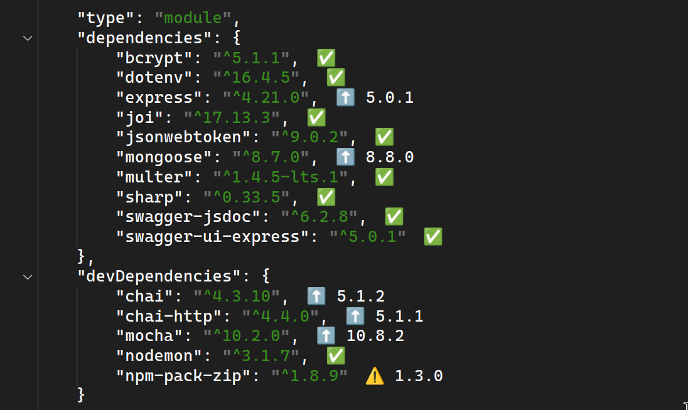

	<h1>Depended</h1>

	

    <a href="https://github.com/Gael-Lopes-Da-Silva/DependedVSCode">https://github.com/Gael-Lopes-Da-Silva/DependedVSCode</a>

 

	
	
	

	

Description
------------------------------------------------------------------

Depended is a simple extension that check the dependency file of your projects and their dependencies versions. It will display according to the current version if it's is up to date, invalid or if an update is available and which version.

Supported languages
------------------------------------------------------------------

Right now we support the following languages.
- Javascript (npm)
- Rust (crates.io)
- Php (packagist)
- Python (pypi)

Options
------------------------------------------------------------------

Depended has 2 command available right now. `Colored: Toggle Display` that turn on or off dependencies icons and `Colored: Update Version Cache` that clear the current version cache and refetch updated list of versions of the dependencies.

~~~json
{
    "depended.display": true, // Turn on or off dependencies icons of all languages
    "depended.normalIcon": "✅", // Icon used when the latest dependency is used
    "depended.updateIcon": "⬆️", // Icon when an update is available for the dependency
    "depended.invalidIcon": "⚠️", // Icon used when invalid or unkown dependency version used
    "depended.problemIcon": "❌", // Icon when a dependency was not found
    "depended.javascript.display": true, // Turn on or off dependencies icons for javascript
    "depended.rust.display": true, // Turn on or off dependencies icons for rust
    "depended.php.display": true, // Turn on or off dependencies icons for php
    "depended.python.display": true, // Turn on or off dependencies icons for python
}
~~~

Screenshots
------------------------------------------------------------------

How to build
------------------------------------------------------------------

If you want a build of Depended you can find it in the release section or in the [build](./build/) folder. Else use `vsce package` in the project folder.

How to install
------------------------------------------------------------------

To install, open visual studio code and go to the extention menu. Click on the three dots and click on `Install from VSIX` and choose the `Depended-X.X.X.vsix` file. Or just install it on the market place.